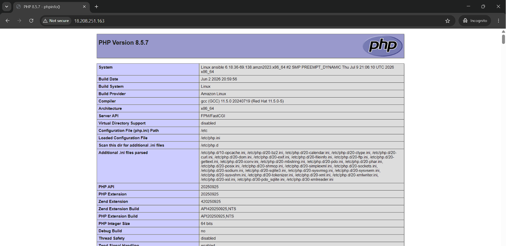

# LAMP Stack Installation using Ansible on Amazon Linux

## Overview

This project automates the installation and configuration of a LAMP Stack on Amazon Linux using Ansible.

### Components Installed

- Apache Web Server (httpd)
- MariaDB Database Server (mariadb105-server)
- PHP
- PHP-FPM

The playbook installs the required packages, starts and enables the services, and deploys a PHP test page.

---

## Prerequisites

- Amazon Linux Instance
- Ansible Installed
- Sudo Privileges
- SSH Access to the Target Host

---

## Project Structure

```
.
├── lamp.yml
├── stop-lamp.yml
└── README.md
```

---

## Installation Playbook

File: `lamp.yml`

This playbook performs the following tasks:

1. Installs Apache (httpd)
2. Installs MariaDB Server
3. Installs PHP and PHP-FPM
4. Starts and enables all services
5. Creates a PHP test page (`index.php`)

### Run the Playbook

```bash
ansible-playbook lamp.yml
```

---

## Verify Services

Check the status of all services:

```bash
systemctl status httpd
systemctl status mariadb
systemctl status php-fpm
```

---

## Access the Application

Open a browser and navigate to:

```text
http://<EC2-Public-IP>/index.php
```

You should see the PHP Information page.

---

## Stop Playbook

File: `stop-lamp.yml`

This playbook stops and disables:

- Apache (httpd)
- MariaDB
- PHP-FPM

### Run the Playbook

```bash
ansible-playbook stop-lamp.yml
```

### Output

---

## Author

**Dhanashri Chaudhari**

**Project:** LAMP Stack Automation using Ansible on Amazon Linux